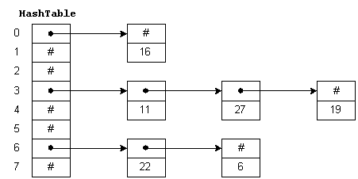
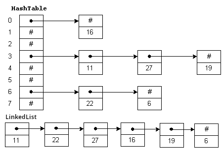
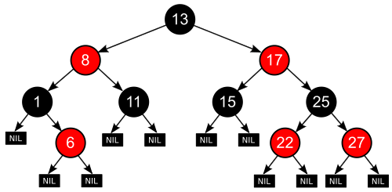

### Set

La interfaz [Set](https://docs.oracle.com/javase/8/docs/api/java/util/Set.html), nos va a permitir, al igual que la interfaz List, almacenar un conjunto de elementos, pero con la diferencia que en este caso no se van a permitir elementos duplicados. Esta interfaz viene a simular el concepto matemático de conjunto, por lo que podremos encontrar algunas de las operaciones más utilizadas sobre conjuntos. Supongamos que a y b son conjuntos:

- a.containsAll(b): Devuelve true si b es un subconjunto de a.
- a.addAll(b): El conjunto a pasa a ser la unión de los dos conjuntos (aUb)
- a.retainAll(b) : El conjunto a pasa a ser la intersección de a y b (a∩b)
- a.removeAll(b): El conjunto a pasa a ser la resta del conjunto a menos el b (a-b)

Del mismo modo que List, Set es una interfaz, por lo que no puede ser instanciada. Para ello, vamos a tener que utilizar cualquiera de las clases que implemente esta interfaz. Las mas comunes son HashSet, LinkedHashSet y TreeSet.

#### HashSet

La clase [HashSet](https://docs.oracle.com/javase/8/docs/api/java/util/HashSet.html) implementa, entre otras interfaces, la interfaz Set, y se apoya en una tabla hash para el almacenamiento de los elementos, y como consecuencia de ello, no puede garantizar el orden el que van a ser devueltos los elementos.

Es probablemente la clase que ofrece un mejor rendimiento, y la que deberemos utilizar en la mayoría de los casos siempre que el orden de los elementos no se deba tener en cuenta.

#### LinkedHashSet

[LinkedHashSet](https://docs.oracle.com/javase/8/docs/api/java/util/LinkedHashSet.html) realmente es un HashSet al que se le ha añadido una lista enlazada para almacenar el orden en el que se han añadido los elementos. De este modo se obtiene un rendimiento muy similar a HashSet, pero ahora sí que podemos garantizar que, a la hora de recorrer el conjunto, este se realizara según el orden en el que fueron añadidos a él.

#### TreeSet

La clase [TreeSet](https://docs.oracle.com/javase/8/docs/api/java/util/TreeSet.html) está basado en un TreeMap que veremos más adelante, pero podemos afirmar que utiliza un árbol binario de búsqueda equilibrado para almacenar los elementos. Para poder ordenar los elementos en el árbol binario, se utiliza por defecto el orden natural de los elementos ([Comparable](https://docs.oracle.com/javase/8/docs/api/java/lang/Comparable.html)), aunque también se puede crear el árbol en base a otro tipo de ordenación utilizando la interfaz [Comparator](https://docs.oracle.com/javase/8/docs/api/java/util/Comparator.html).

