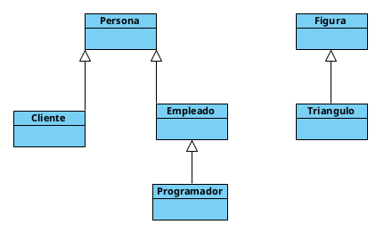

# Herencia 

Si tuviéramos que definir el comportamiento de las piezas de ajedrez, con lo visto hasta ahora, tendríamos un serio problema. Esto es debido a que las piezas de ajedrez, aun siendo todas piezas de ajedrez, tienen comportamientos diferentes. Por ejemplo, los peones solo pueden avanzar hacia delante de uno en uno (excepto en su movimiento inicial), los alfiles en diagonal, los caballos se desplazan en forma de L pudiendo saltar sobre las piezas, etc… 

Entonces, ¿Cómo podemos definir el comportamiento de las diferentes piezas?, la respuesta es mediante la herencia. 

La herencia proporciona todas las herramientas necesarias para crear clases a partir de otras clases por extensión, especialización o combinación. Por herencia nos referimos a la creación de clases hijas, a partir de otras clases padres, y a la propiedad de que las instancias de una clase hija puedan tener acceso tanto a la estructura de datos como al comportamiento asociados con una clase paterna.  

La herencia es multigeneracional y transitiva y organiza las clases en una estructura jerárquica. Pudiendo así compartir y extender su comportamiento sin tener que ser reimplementado. Esto suele hacerse habitualmente agrupando los objetos en *clases* y estas en *árboles* o *enrejados* que reflejan un comportamiento común.  

La herencia puede ser simple, si hereda propiedades y procedimientos de una sola clase, o múltiple, si lo hace de más de una. Esta característica está soportada directamente en C++. En Java en cambio, sólo es posible la herencia de una única clase, pero permite implementar varios interfaces, que son en realidad clases con todos los métodos abstractos y, por tanto, habrá que definirlos.  

Una clase hija puede heredar todos o parte de los métodos y las propiedades, pudiendo a su vez reemplazar o refinar los métodos de la clase padre.  

En la siguiente imagen, podemos ver dos casos de herencia:



En el ejemplo mas sencillo, tenemos una clase Triangulo, que hereda de Figura. Esto quiere decir, que la clase Triangulo desciende de Figura, siendo Triangulo la clase hija, y Figura la clase padre. Como la herencia  se transfiere de padres a hijos, la clase Triangulo tendra todas las caracteristicas definidas en Triangulo mas la de su padre Figura. Pero por el contrario, la clase Figura solo dispondra de las caracteristicas definidas en su propia clase, no pudiendo heredar las de su clase hija. 

Para poder implementar este caso, vemos como se decara la clase Triangulo.

```java
public class Triangulo extends Figura {

}
```

En el otro ejemplo, tenemos la clase Persona que es una clase de padre de Cliente y Empleado. Del mismo modo la clase Empleado es una clase padre de Programador. Segun esto, la clase Programador hereda las propiedades tanto de Empleado y como a su vez, esta hereda de Persona, la Programador tambien hereda las propiedades de esta. Si lo pensamos bien, es logico que suceda esto, pues un programdor es un tipo de empleado, pero tambien es una persona. Por el contrario, un programador, no tendrá las caracteristicas de un Cliente, puesto que no hereda de este.


Visto como se define una relación de herencia en java, modifica las clases Cliente, Empleado y Programador para que se ajusten al diseño de la imagen anterior.