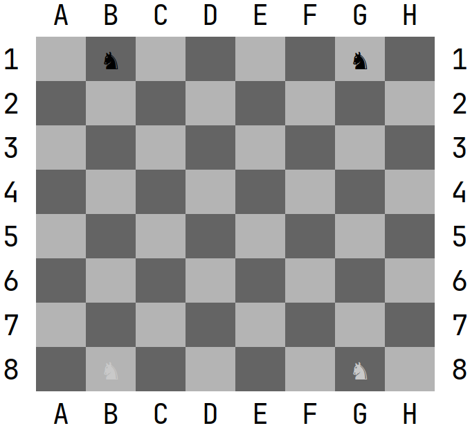
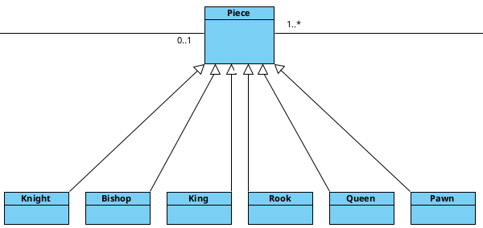

# Un caso de práctico.Herencia 

Vamos a empezar a ver un caso práctico con la ficha del caballo. El caballo es un **tipo de ficha** que difiere del resto de fichas en su forma y su comportamiento. Por ejemplo, es la única ficha que puede moverse a pesar de estar rodeada de fichas, es decir, es como si pudiese saltar. 

 

###  **♞** Knight

Para empezar a definir esta ficha, debemos tener claro que el caballo, al igual que el resto de fichas, es una especialización de ficha, es decir es un tipo particular de esta. Así pues, vamos a definirla a partir de una definición que ya tenemos que es la de Piece. Para ello deberemos utilizar la palabra reservada extends seguido de la clase que queremos heredar como hemos visto anteriormente. Hay que tener en cuenta que las clases hijas pueden añadir atributos y métodos, a los que ya dispone de su clase padre. Para que una clase hija pueda acceder a los métodos y atributos de su clase padre, estos deben estar declarados como públicos (**public**) o protegidos (**protected**). 

Por otro lado, si la clase padre tiene definido un constructor, este ha de ser llamado en la primera línea del constructor de la clase hija. Así pues, ¿Cómo podemos invocar el constructor de la clase padre?, la respuesta es con la palabra reservada **super**. 

Del mismo modo que la palabra reservada *this* hacía referencia al propio objeto, *super* hace referencia a la clase padre: 

```java
public class Knight extends Piece { 

    public Knight(Board board, Coordinate position, Knight.Type type) { 
        super(type.getType(), board.getCell(position)); 
    } 


    public enum Type { 
        BLACK(Piece.Type.BLACK_KNIGHT), WHITE(Piece.Type.WHITE_KNIGHT); 
        private Piece.Type type; 

        KnightType (Piece.Type type) { 
            this.type = type; 
        } 

        public Piece.Type getType() { 
            return type; 
        } 
    } 
} 
```

Como en la clase Piece tenemos un constructor, que recibe un tipo de ficha y una celda, estos dos parámetros deberemos obtenerlos para poder invocar el constructor de la clase padre. Además, para poder crear un caballo blanco o negro, también debemos recibir el tipo de caballo (blanco o negro). Para esto último, con el fin de limitar el tipo de fichas que podemos recibir por el constructor, puedes observar cómo se ha creado un subconjunto de los valores del enum de Piece. 

Otra posible solución a este problema, podría haber sido que en el constructor de Knight en lugar de recibir un tipo, que recibiese un color, y en función de este establecer el tipo correcto. El problema de esta solución, es que averiguar el tipo en función del color impediría llamar en primer lugar al constructor de la clase padre (Piece), ya que esta debe ser la primera instrucción en el constructor, y como única solución, quedaría modificar el constructor de Piece, lo que llevaría a un problema de diseño, ya que se podrían tener piezas sin un tipo definido. 

Observa como en la clase Piece, se ha añadido el siguiente método protegido: 

```java
protected void place() {
    if(cell!=null)
        cell.setPiece(this);
}
```

Este método es llamado directamente en el constructor de Piece, para que la pieza se coloque de manera automática a la hora de crearla. Este metodo podremos utilizarlo dentro de la clase Piece y las clases que hereden de ella, pero no fuera de estas.

Una vez hechos estos cambios, observa como podemos crear caballos, y colocarlos directamente en el tablero:

```java
Board b = new Board();
new Knight(b,new Coordinate('B',1), Knight.KnightType.BLACK);
new Knight(b,new Coordinate('G',1), Knight.KnightType.BLACK);
```

Si imprimimos el tablero podremos ver lo siguiente:



Observa como los caballos se muestran correctamente en el tablero sin haber sobrescrito el método toString(). Esto es debido porque la clase Knight hereda el método toString() de Piece.

Ahora puede que no le veas la utilidad de crear una clase Knight, pero como veremos mas adelante, esta clase implementara el comportamiento que tienen los caballos en el ajedrez, que sera distinto al comportamiento que tenga una torre o un alfil. Esto es debido a que,  aunque todas ellas son piezas (todas heredan de Piece), cada una podra tener un comportamiento diferente.


Siguiendo el mismo patrón que Knight, completa las clases KingTests, Queen, Bishop, Rook y Pawn. Observa que deberás crear un enum de cada una de ellas para limitar su tipo, y heredar cada una de ellas de la clase Piece.

