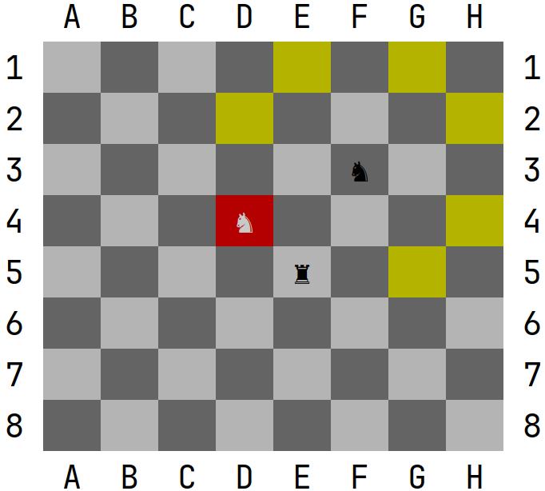

# Clases abstractas 

Hasta este momento, en lo que respecta a las fichas de ajedrez, tenemos la clase Piece y las respectivas declaraciones de las clases de las diferentes fichas de ajedrez. Del modo que tenemos ahora las diferentes declaraciones, podríamos tener objetos de tipo Knight, Rook, Pawn, etc…, pero también podríamos tener objetos de tipo Piece. Esta situacion no es la que nosotros deseamos, pues un objeto instanciado directamente de Piece, no es ni un caballo, ni un alfil, ni un peon, etc… 

Para este tipo de casos, en la programación orientada a objetos, disponemos como hemos visto, de las clases abstractas. Las clases abstractas, nos permite declarar clases que no pueden ser instanciadas, es decir, si declaramos la clase Piece como abstracta: 

 

```java
public abstract class Piece { 
    … 
    public Piece(Cell cell){ 
        this.cell = cell; 
    } 
    … 
} 
```

no podremos realizar lo siguiente: 

```java
Piece piece = new Piece(board.getCell(position)); 
```

Básicamente las clases abstractas nos permiten declarar clases, pero para poder crear objetos, deberemos utilizar clases hijas que hereden de esta. 

Por otro lado, como hemos visto las clases abstractas, pueden declarar métodos abstractos. Estos métodos, no contienen su implementación, solo la declaración. Esto obligara a que las clases hijas que hereden de esta se vean obligados a implementar dichos métodos. 

En nuestro ejemplo del ajedrez, sería interesante que cada ficha nos pudiese devolver un conjunto de movimientos posibles según el tipo de ficha que sea, y de la situación del tablero. Si nosotros queremos que todas las clases tengan esta función, la mejor solución es declarar en Piece un método abstracto. Esto obligara a que todas las clases hijas deban implementar esta funcionalidad. Por ejemplo, en la clase Piece, podemos añadir lo siguiente: 

```java
public abstract Coordinate[] getNextMovements(); 
```

Observe como el método getNextMovements() no tiene implementación, y está declarado como abstracto mediante la palabra reservada abstract. Una vez hecho esto, el entorno de desarrollo nos deberá marcar como error que falta la implementación de dicho método en todas las clases que heredan de Piece. 

Este método quizás no es el mas adecuado para devolver las diferentes posiciones a las que se puede mover una ficha, pero como todavia no hemos visto colecciones, utilizaremos un array para devolver las diferentes coordenadas a las que se puede mover una pieza. Para poder realizar esta labor, de momento vamos a necesitar una clase Tool que nos permitirá imitar el crecimiento de un vector en tiempo de ejecucion.

```java
public class Tool {

    public static Coordinate[] add(Coordinate coordinate, Coordinate[] array){

        if(coordinate==null) return array;

        Coordinate[] aux = Arrays.copyOf(array,array.length+1);

        aux[aux.length-1]=coordinate;

        return aux;       
    }
}
```

Ahora veamos como podemos implementar el método getNextMovements() para el caballo:

```java
@Override
public Coordinate[] getNextMovements() {

    Coordinate[] nextMovements = new Coordinate[0];

    Coordinate myPosition = getCell().getCoordinate();
    Coordinate c;

    //Up
    c = myPosition.up().up().left();
    if(canAddToNextMovements(c)) nextMovements = Tool.add(c,nextMovements);

    c = myPosition.up().up().right();
    if(canAddToNextMovements(c)) nextMovements = Tool.add(c,nextMovements);

    //Down
    c = myPosition.down().down().left();
    if(canAddToNextMovements(c)) nextMovements = Tool.add(c,nextMovements);

    c = myPosition.down().down().right();
    if(canAddToNextMovements(c)) nextMovements = Tool.add(c,nextMovements);

    //Left
    c = myPosition.left().left().up();
    if(canAddToNextMovements(c)) nextMovements = Tool.add(c,nextMovements);

    c = myPosition.left().left().down();
    if(canAddToNextMovements(c)) nextMovements = Tool.add(c,nextMovements);

    //Right
    c = myPosition.right().right().up();
    if(canAddToNextMovements(c)) nextMovements = Tool.add(c,nextMovements);

    c = myPosition.right().right().down();
    if(canAddToNextMovements(c)) nextMovements = Tool.add(c,nextMovements);


    return nextMovements;
}

private boolean canMoveTo(Coordinate c) {

    Board board = getCell().getBoard();

    if(!board.contains(c)) return false;

    if(board.getCellAt(c).isEmpty()) return true;

    if(board.getCellAt(c).getPiece().getColor()!=getColor()) return true;

    return false;
}
```

Como puedes observar, el método getNextMovements(), va comprobando para todas las posibles posiciones a las que puede llegar, si se puede mover alli. Para ello usaremos el método canMoveTo(Coordinate c), que funciona de la siguiente manera:

- Si la posición a la que queremos ir esta fuera del tablero (el tablero no contiene esa coordenada), automáticamente devolvemos que no.
- Si la celda que se encuentra en la coordenada indicada esta vacía, devolveremos que si se puede mover alli.
- Si la celda contiene pieza, solamente permitiremos que vaya a esa posición si la pieza es del color contrario, ya que en este caso, lo que se hara es matar a la pieza que ocupa esa posición. 

Observa el resultado para el siguiente codigo:

```java
Board b = new Board();

Coordinate[] nextMovements = new Knight(b,new Coordinate('B',1), Knight.Type.BLACK).getNextMovements();

System.out.println(b);       
System.out.println(Arrays.toString(nextMovements));
```


Observa como el caballo situado en (C,1), de todas las posiciones posibles a las que puede ir, solo incluye aquellas posiciones donde la celda esta vacía o puede matar a la pieza que contiene.

<div class="hint">
    Prueba a cambiar el caballo de posicion en la clase Main, y observa como para cada posicion, el caballo nos indica correctamente las diferentes posiciones donde puede ir.
</div>


Realiza las siguientes tareas:

- Haz que la clase Piece sea abstracta:

- Añade el método abstracto getNextMovements() en Piece.

- Observa como a partir de crear Piece como abstracta y añadir el metodo abstracto, las todas las clases que heredan de Piece dan error. Implementa el método abstracto en cada una de ellas, como se ha hecho en la clase Knight, para que cada pieza nos devuelva las diferentes posiciones a las que puede ir dependiendo de su tipologia.

  <div class="hint">
      Cada pieza debe resolver este punto de una manera diferente, por lo que igual no debes seguir el mismo patron que el resuelto de ejemplo. Por otro lado, observa que los movimientos de la reina, alfil y torre, son muy similares. Intenta buscar una solucion en la que no tengas codigo repetido.
  </div>
  <div class="hint">
      Puedes visualizar las diferentes coordenadas que devuelve cada metodo getNextMovements() de una manera visual. Utiliza la clase Prueba para ver que coordenadas devuelven tus piezas. Para ello solo deberas invocar el metodo  highlight(Coordinate[] coordinates) del tablero. Después simplemente visualiza el tablero.
      
      Observa como en el ejemplo anterior, para la obtencion de los siguientes movimientos del caballo situado en (F,3), si que se incluyen las celdas donde se mata una pieza del contrario, y se elimina la coordenada correspondiente a una celda ocupada por una pieza de nuestro color.
  </div>
