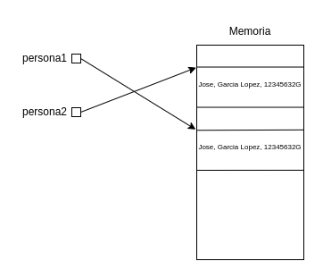
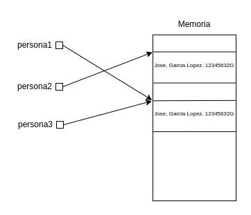

# Equals vs ==

Ahora que ya hemos visto que son los objetos, vamos a ver la diferencia entre comparar objetos utilizando el método equals y el operador ==.

Hasta ahora, muchas veces hemos utilizado ambos de una manera indiferente, dando la sensación de que son formas equivalentes, pero nada mas lejos de la realidad.

Para entender bien ambas formas, debemos tener claro que sucede cuando creamos un objeto. Por ejemplo, dada la clase Persona, veamos que sucede cuando creamos dos objetos de la siguiente manera:

Persona persona1 = new Persona("Jose","Garcia Lopez","12345632G");

Persona persona2 = new Persona("Jose","Garcia Lopez","12345632G");

Internamente, java reserva un espacio en memoria capaz de almacenar cada uno de los objetos persona. Es decir, en memoria hay un espacio por cada objeto donde se almacenara entre otras cosas, el nombre, apellidos y DNI de cada una de las personas, y la dirección para poder acceder a esos datos sera guardado en la variable persona1 y persona2.



De esta manera, mediante las variables persona1 y persona2, podemos acceder a los objetos, es decir al área en memoria donde se encuentran almacenados.

Entonces, ¿que es lo que hacen el método equals y los operadores == ?. Pues básicamente lo siguiente:

- El método equals, teoricamente esta destinado a decir si dos objetos son iguales.
- El operador ==, esta pensado para indicar si dos objetos son el mismo.

Ahora la pregunta es: ¿Que pasaría si intentáramos comparar persona1 y persona2 de la siguiente manera?

```java
System.out.println(persona1==persona2);

System.out.println(persona1.equals(persona2));
```

Extrañamente, si ejecutamos lo anterior, en ambos casos nos indicará false. ¿Qué está ocurriendo?

Esta claro que la primera instrucción debe dar false, ya que persona1 y persona2 no son el mismo objeto, ya que ocupan espacios en memoria diferente, observa que si realizamos el siguiente cambio, la respuesta cambia:

```java
Persona persona3 = persona1;
```



En este caso, persona3 si que apunta al mismo objeto que persona1, por lo que la siguiente instrucción si que dará true:

```
System.out.println(persona1==persona3);
```

¿Pero que pasa con el método equals?. La respuesta es algo mas compleja. Todos los objetos tienen el método [equals](https://docs.oracle.com/javase/8/docs/api/java/lang/Object.html#equals-java.lang.Object-), ya que este esta definido en la clase [Object](https://docs.oracle.com/javase/8/docs/api/java/lang/Object.html), por lo que todas las clases, como heredan de Object, todas tendrán este método tal y como esta definido en Object.

Si vemos la documentación oficial, veremos cual es el comportamiento de este método y que propiedades tiene, pero por hacer un resumen, para dos objetos no nulos, solo devolverá true en el caso de que sean el mismo objeto. Vamos que si funciona mas o menos igual que el operador ==.

Ahora bien, lo lógico, o esperable, seria que que para la comprobación:

```
persona1.equals(persona2)
```

se devolviera true, ya que realmente estamos haciendo referencia a la misma persona. Para ello, lo que deberemos hacer es sobrescribir el método, e indicar que es lo que para nosotros implica que sean personas iguales.

En la mayoría de los casos, para que dos objetos sean iguales (que no el mismo), tendremos que comprobar todos los atributos del objeto, y de ser iguales devolveremos true, dando a entender que son iguales. Por ejemplo:

```java
@Override
public boolean equals(Object obj) {
    if(obj == null) return false;
    
    if(!(obj instanceof Persona)) return false;
    
    Persona p = (Persona) obj;
    return p.nombre.equals(nombre) && p.apellidos.equals(apellidos) && p.DNI.equals(DNI);
}
```

Observa como lo primero que realizamos, es comprobar si obj es nulo, ya que en caso afirmativo podemos afirmar que no son iguales.

Después, deberemos comprobar si obj es una instancia de Persona, ya que en caso contrario no tiene sentido comprobar nada. Observa que para ello utilizamos el operador instanceof que nos indica si el objeto es una instancia de esa clase. Al final de este [link](https://docs.oracle.com/javase/tutorial/java/nutsandbolts/op2.html), puedes encontrar mas información de este operador.

Por ultimo, hacemos un casting y devolveremos true en el caso de que se cumpla que todos los atributos son iguales.

Esta forma puede ser útil para la mayoría de los casos, pero quizás hubiera sido mejor comprobar unicamente si ambas personas tienen el mismo DNI, independientemente de como se llamen. Nuestra labor, sera en cada caso determinar que condiciones se han de cumplir para afirmar cuando dos objetos son iguales.

Después de sobrescribir el método, podemos comprobar como ahora si que tenemos la salida esperada.


Ejecuta la clase Main y descomenta el método equals en Persona para comprobar lo descrito anteriormente.

Prueba a modificar el método equals para que solo compruebe por DNI y realiza las pruebas necesarias para ver los efectos.

Ejecuta la clase EjemploInvestigacion e intenta dar respuesta al resultado obtenido:
¿Porque s1==s2 da true, pero s1==s3 da false?