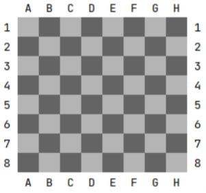

Ahora que tenemos definida una coordenada del tablero, ¿Cuál podría ser su comportamiento? La respuesta es que, a priori, realmente las coordenadas no tienen un comportamiento, pero puede sernos útil que una coordenada nos pueda dar las coordenadas que tendría arriba, abajo, a la izquierda y derecha. 

Estos métodos, nos pueden ser útiles cuando debamos obtener los diferentes desplazamientos de la torre o la reina, e incluso algunos del peón, pero ¿qué pasa por ejemplo, con el alfil? La solución podria ser utilizar una combinacion de los anteriores o como completar la lista de movimientos para obtener los movimientos en diagonal.

Completa la clase Coordinate para dotarla de un comportamiento. Añade los siguientes metodos:

- up() : Obtiene la coordenada superior
- down() : Obtiene la coordenada inferior
- left() : Obtiene la coordenada a la izquierda
- right() : Obtiene la coordenada a la derecha
- diagonalUpLeft() : Obtiene la coodenada superior izquierda
- diagonalUpRight() : Obtiene la coodenada superior derecha
- diagonalDownLeft() : Obtiene la coodenada inferior izquierda
- diagonalDownRight() : Obtiene la coodenada inferior derecha

 