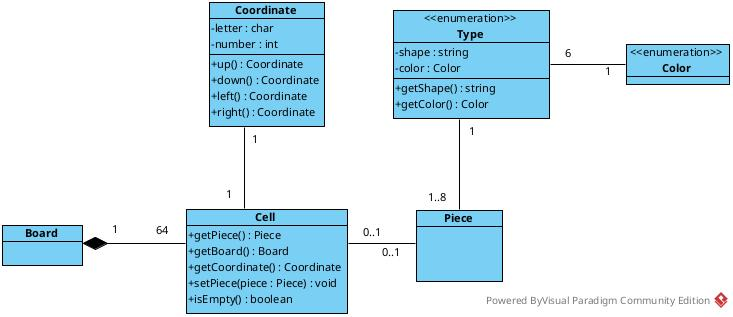

Si nos fijamos en el enum Type, puedes observar como el enum tiene dos atributos (shape y color) así como los getters necesarios. También puedes observar cómo los diferentes valores del enum llaman al constructor del enum, que es privado, con los valores que deseamos. En el caso de la forma, esta puede ser expresada en notación Unicode o bien con el carácter en cuestión. 

Como se observa, las definiciones de los enumerados, están dentro de la propia clase. Estas definiciones de Color y Type, podrían perfectamente estar en ficheros individuales, pero si existe, como en este caso, una fuerte relación con una clase, no teniendo sentido fuera de esta, se suelen implementar de la forma descrita. 

Nótese que en el código de Piece anterior se ha añadido un atributo más que es cell. Este atributo hace referencia a la celda del tablero (Board) donde está la ficha. 

La clase Celda, que representa a cada una de las casillas por la que está formado el tablero, estaría definida por:

- Su coordenada en el tablero, 
- El tablero al que pertenece dicha celda 
- Una ficha de ajedrez que puede contener.

 

Hasta ahora, hemos creado la clase Piece, donde hemos establecido en primera instancia, los atributos que a simple vista hemos visto necesarios. Como veremos más adelante, esta definición de clase, está todavía lejos de estar completa, aunque es un buen punto de partida. 

La clase del tablero (Board) todavía no la hemos definido, ya que lo haremos mas adelante, así que para que no marque como un error, de momento la clase Board estará vacía.  

Completa la clase Cell con:

- Los siguientes atributos:
  - Un atributo piece de tipo Piece
  - Un atributo board de tipo Board
  - Un atributo coordinate de tipo Coordinate.
- Un constructor:
  - Un constructor parametrizado que reciba solamente la coordenada y el tablero al que pertenece. Se supone que cuando se crea la celda, esta no deberia contener ninguna pieza.
- De momento los siguientes metodos:
  - Getters para todos los parametros.
  - Setters unicamente para la pieza
  - Un metodo llamadao isEmpty() que nos indique si la celda contiene o no una pieza.