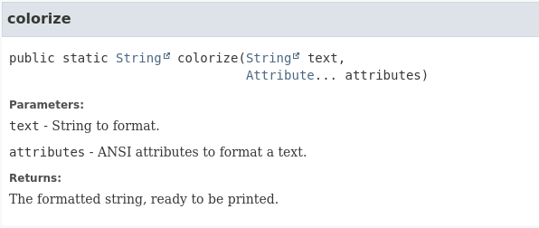
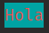
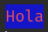

# Uso de librerias externas. JColor

Antes de ver como podemos representar una pieza y un tablero en color para poder representar de una manera mas fiel estos objetos en nuestra aplicacion, vamos con un poco de teoria.

Para dar un mejor aspecto a nuestro ajedrez, vamos a utilizar una libreria externa que nos va a permitir dar color a nuestro juego y para ello vamos a utlizar una libreria llamada [JColor](https://github.com/dialex/JColor).

Para poder utilizar esta libreria, primero deberemos importarla a nuestro poryecto. Esto no es necesario en este proyecto, pero en cualquier otro si que la deberemos importar. Para hacer esto simplemente buscaremos la libreria, por ejemplo en [mvnrepository](https://mvnrepository.com/artifact/com.diogonunes/JColor) .

Una vez seleccionada la version que queramos importar, tendremos que copiar los datos necesarios para su importacion dependiendo del gestor de dependencias que utilicemos. Por ejemplo:

- Para proyectos maven, deberemos editar el fichero pom.xml y añadir el siguiente texto dentro de las etiquetas <depencies> :

  ```xml
  <!-- https://mvnrepository.com/artifact/com.diogonunes/JColor -->
  <dependency>
      <groupId>com.diogonunes</groupId>
      <artifactId>JColor</artifactId>
      <version>5.5.1</version>
  </dependency>
  ```

- Para proyectos gradle, deberemos editar el fichero build.gradle y añadir el siguiente texto:

  ```xml
  // https://mvnrepository.com/artifact/com.diogonunes/JColor
  implementation group: 'com.diogonunes', name: 'JColor', version: '5.5.1'
  ```


Una vez sincronizado el proyecto y descargadas las librerias, ya podemos utilizarlas.

Desde su [repositorio](https://github.com/dialex/JColor) podemos acceder a toda la documentacion, pero nosotros solo nos vamos a centrar en unas pocas funcionalidades, y se deja al alumno una mas profunda investigacion si asi lo desa.

Para colorear un texto, simplemente vamos a utilizar la funcion colorize que nos proporcionara un String ya formateado listo para imprimir con un print.

Si observamos la documentacion oficial, podemos ver como es su utilizacion:



 Observa, que simplemente debemos pasar a la funcion el texto que queremos colorear como primer parametro, y luego una lista de Attribute con los atributos de color que queremos emplear. Asi que solo nos queda ver, como son esos atributos de color.

Si vemos la [documentacion ofician](https://dialex.github.io/JColor/com/diogonunes/jcolor/Attribute.html), veremos que la calse Attribute, tiene una gran variedad de metodos estaticos que podemos invocar para conseguir ese Attribute deseado. 

Principalmente tenemos dos grupos de atributos (aunque hay mas) que nos interesan. Por un lado tenemos los atributos que van a definir el color de la tinta con la que queremos imprimir (estos tienen en el nombre la palabra TEXT) y por otro lado los atributos que definen el color de fondo (estos tienen en el nombre la palabra BACK). De este modo si queremos imprimer el texto "Hola" con tinta roja sobre un fondo azul, podemos utilizar la funcion colorize de la siguiente manera:

```java
System.out.println(colorize("Hola",RED_TEXT(),CYAN_BACK()));
```



Obviamente, deberemos realizar los imports correspondientes:

```java
import static com.diogonunes.jcolor.Ansi.colorize;
import static com.diogonunes.jcolor.Attribute.*;
```

Si queremos utilzar otra paleta de colores, tenemos la opcion de poder pasar el color en modo RGB tanto para la tinta como para el color de fondo. Para ello utlizaremos las siguientes funciones:

```java
static Attribute BACK_COLOR(int r, int g, int b)

static Attribute TEXT_COLOR(int r, int g, int b)
```

 Aqui podemos ver un ejemplo utilizando ambas combinaciones:

```
System.out.println(colorize("Hola",RED_TEXT(),BACK_COLOR(100,23,200)));
```



Para poder ver un ejemplo de utilizacion de esta libreria, ejecuta la clase Main y veras un ejemplo de todo lo que puedes realizar.