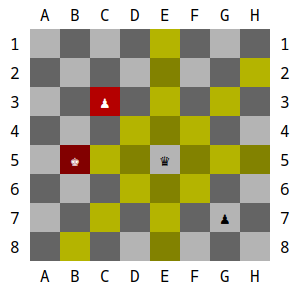

# Dando color a la celda y pieza

Antes de crear nuestro tablero, deberemos definir como serán cada una de las celdas que formarán nuestro tablero. Básicamente la celda deberá contener (o no) una pieza, además de un color que puede ser blanco o negro. Asimismo, las celdas de nuestro juego, deberán poder tomar otros colores durante el juego, cuando una pieza pueda moverse a ella. De este modo podemos definir nuestra celda con los siguientes atributos: 

 

```java
public class Cell { 
 
  private Piece piece; 
  private Board board; 
  private Coordinate coordinate; 
    
  private Color originalColor; 
  private Color color; 

} 
```

 

 

Como ya hemos visto antes, tenemos un atributo piece que tendrá la referencia a la pieza que está en la celda o nulo cuando no contenga ninguna pieza. También tenemos un atributo board, que hará referencia al tablero al que pertenece nuestra celda, así como la coordenada asociada a ella. 

Como puedes observar, tenemos dos atributos mas que hacen referencia al color. El atributo originalColor, hace referencia al color original de la celda, donde este solo puede ser blanco o negro, mientras que el atributo color hace referencia al color que se debe utilizar a la hora de dibujar la celda, y que puede ser cualquiera de los cuatro posibles como podemos observar en la siguiente imagen: 




 

- Amarillo: Cuando la celda forme parte de los posibles movimientos de la pieza seleccionada y no se mate ninguna ficha del oponente. 
- Rojo: Cuando la celda forme parte de los posibles movimientos de la pieza seleccionada y se mate una ficha del oponente. 
- Blanco: Cuando la celda no forme parte de los posibles movimientos y el color original de la celda sea blanco. 
- Negro: Cuando la celda no forme parte de los posibles movimientos y el color original de la celda sea negro. 

  

Para crear una celda, como ya hemos visto, solamente necesitaremos conocer los valores del tablero al que pertenece y su coordenada asociada. El resto de valores los podemos obtener a partir de estos.

Como se puede observar, todavía no tenemos definidos los colores para la celda. Para ello vamos a crearnos una enum con los diferentes colores posibles. Ten en cuenta, que cuando se resalte una celda, y esta se ponga por ejemplo de color amarillo, ese color amarillo no debería ser el mismo si el color de la celda original es blanco o negro. Por eso definiremos dos colores amarillos y dos colores rojos, para mostrarlos según sea el color original de la celda.  

Este enum, debera tener un atributo color de la clase Attribute definida en la librería JColor. Este atributo definirá el color de fondo (Attribute.BACK_COLOR(r,g,b)) con el que se deberá pintar cada color, definiendo este mediante la nomenclatura RGB. 


Realiza las siguientes tareas:

1. Completa el enum Color para establecer los diferentes colores que puede tomar la celda seguna la situacion de juego. Para ello deberas:
   - Crea un atributo llamado color del tipo Attribute.
   - Crea un constructor parametrizado.
   - Añade un getter que devuelva el atributo.
   - Crea los diferentes colores:
     - **WHITE**: Con un valor R:180,G:180,B:180
     -  **BLACK**: Con un valor R:100,G:100,B:100
     - **HIGHLIGHT_KILL_WHITE**: Con un valor R:180,G:0,B:0
     - **HIGHLIGHT_KILL_BLACK**: Con un valor R:130,G:0,B:0 
     - **HIGHLIGHT_WHITE**: Con un valor R:180,G:180,B:0
     - **HIGHLIGHT_BLACK**: Con un valor R:130,G:130,B:0
2. Modifica el enum Color de Piece:
   - Modifica los colores **BLACK** y **WHITE**, para que almacenen los atributos de los colores de las piezas. Asi pues, añade un atributo en el enum llamado color, y asigna al color BLACK el color (r:0,g:0,b:0) y al color WHITE el color (r:255,g:255,b:255).
   - Añade un getter para poder obtener el atributo del color.
3. Completa el constructor de Cell para inicializar el atributo originalColor como **BLACK** o **WHITE**. Para ello deberas:
   - Realizar un pequeño cálculo en función de la coordenada que tenga asociada la celda. Observa que si la suma del número y la letra de la coordenada es impar, la celda es negra, mientras que si es par, la celda es blanca. 
   - Por último, deberas asignar este mismo valor al atributo color.