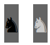
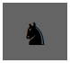
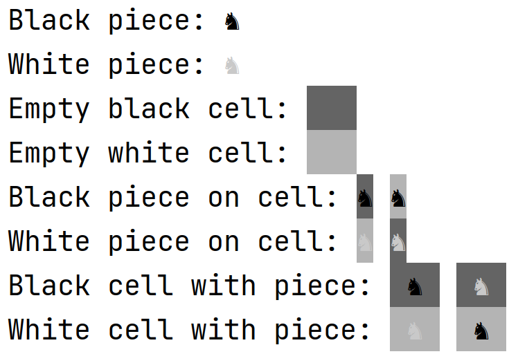

# Dibujando piezas

Una vez modificado el enum Color de Piece como hemos hecho en el punto anterior, para dibujar la pieza por consola, deberemos sobrescribir el método toString(), y deberemos utilizar los colores vistos a la hora de dibujar la celda. 

Para ello, a la hora de dibujar una pieza deberemos obtener el tipo de pieza de Type. De su tipo podemos obtener la forma de esta ademas del color. Observa que una vez obtenido su color, para obtener el Attribute, deberemos invocar el getter correspondiente.

Ademas de pintar la ficha de su propio color, deberemos comprobar si la pieza esta en una celda, pues en caso de que se encuentre sobre una celda, deberemos imprimir como color de fondo el color de la celda.

Sobrescribe el método toString() de Piece, y realizando las siguientes acciones:

- Comprueba si la pieza esta sobre una celda. Para ello solo debes comprobar si el atributo encargado de esto es nulo. Dependiendo de si esta en una celda o no, realiza:
  - Si no esta en una celda, deberás devolver mediante el método colorize visto anteriormente, la forma, usando como tinta el atributo del color de la pieza. Ejemplo de dos piezas que no estan en una celda 
  
  - Si la pieza esta en una celda, ademas de lo anterior, deberás devolver como color de fondo el color de la celda. Asegúrate de utilizar el color con el que se muestre la celda y no con su color original. Ejemplo de dos piezas que estan en una celda negra. 

# Dibujando las celdas

Para dibujar las celdas, vamos a tener que sobrescribir también el método toString() de la clase Cell. Para ello, vamos a tener que devolver un String de 3 caracteres. Estos caracteres dependerán de si la celda contiene pieza no. 

Si la celda no contiene pieza, se devolverán tres espacios en blanco con el color de fondo de la celda. Si por el contrario la celda contiene pieza, se devolveran tres caracteres, siendo el primero y el ultimo un espacio en blanco con el color de fondo de la celda. El carácter de en medio, correspondera a la impresion de la pieza, y para ello delegaremos en el metodo toString() de Piece.

Sobrescribe el método toString() de Cell. Para ello deberás:

- Comprobar si la celda contiene pieza:
  - Si la celda no contiene pieza, se deberá devolver el resultado de la funcion colorize, imprimiendo tres espacios en blanco, y como Attribute el color de la celda. Observa que debes devolver el valor del atributo color.
  
    |            Empty black Cell             |            Empty white Cell             |
    | :-------------------------------------: | :-------------------------------------: |
    |  |  |
  
  - Si la celda contiene pieza, se devolvera el resultado de concatenar el metodo de colorize con un espacio en blanco y con el atributo de color de la celda, seguido de aplicar el método toString() de la pieza y terminando con otra vez, el resultado de aplicar colorize a un espacio en blanco y como atributo el color de la celda.
  
    |            Black Cell with Piece            |            White Cell with Piece            |
    | :-----------------------------------------: | :-----------------------------------------: |
    |  |  |

Aunque los test sean correctos, puedes comprobar si se visualizan correctamente cada uno de los casos ejecutando la clase DisplayTest. Aquí puedes ver como debería ser el resultado de esta visualización:

 

