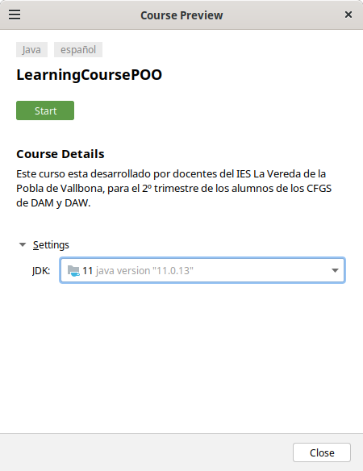

Curso realizado como material de apoyo para el modulo de programación de DAW/DAM.

Para poder utilizar este curso, se debe utilizar la versión [Ultimate de IntelliJ](https://www.jetbrains.com/idea/download/other.html), así como utilizar el [JDK 11 de Oracle](https://www.oracle.com/es/java/technologies/javase/jdk11-archive-downloads.html).

