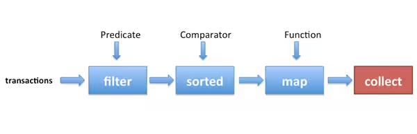

# Streams y Lambdas

### Lambdas

Antes de ver que son y como trabajar con Streams, es interesante entender las funciones Lambda, y para ello antes tenemos que ver el concepto de interfaz funcional. 

Podemos definir una interfaz funcional, como una interfaz que solo tiene un método abstracto que se debe definir. Un ejemplo de esto lo tenemos en las interfaces [Comparable](https://docs.oracle.com/javase/8/docs/api/java/lang/Comparable.html), [Comparator](https://docs.oracle.com/javase/8/docs/api/java/util/Comparator.html) o [Predicate](https://docs.oracle.com/javase/8/docs/api/java/util/function/Predicate.html).

Una vez sabemos que una interfaz funcional es una interfaz con un solo metodo abstracto, podemos definir una expresion Lambda, como la minima expresion para implementar ese metodo abstracto. Por ejemplo, si tuviéramos que crear una clase anónima que implementase la interfaz Predicate, podríamos hacer lo siguiente:

```java
Predicate<Persona> predicate = new Predicate<Persona>() {
   @Override
   public boolean test(Persona p) {
      return p.getEdad()>=18 ;
   }
} ;
```

Observa toda la pomposidad de Java, que para decir que se ordenen por nombre, la sintaxis esta llena de texto que no aporta nada. Por ejemplo, podemos omitir todo lo que no aporta nada, dejando lo siguiente:

```
Predicate<Persona> predicate = (p) -> p.getEdad()>=18 ;
```

Veamos otro ejemplo, ahora para la interfaz funcional Comparator:

```java
Comparator<Persona> comparator = new Comparator<Persona>() {
   @Override
   public int compare(Persona p1, Persona p2) {
      return p1.getNombre().compareTo(p2.getNombre());
   }
};
```

Quedaría así:

```java
Comparator<Persona> comparator = (p1, p2) -> p1.getNombre().compareTo(p2.getNombre());
```

Para Comparator, en algunos casos, todavía podríamos expresarlo de una manera todavía mas reducida, empleando algunos comparadores estáticos. Por ejemplo, en este ultimo caso, podríamos expresar los mismo de la siguiente manera:

```
Comparator<Persona> comparator = Comparator.comparing(Persona::getNombre);
```


### Streams

Las colecciones, como hemos visto, sirve para agrupar elementos de maneras diferentes, y nos permiten realizar operaciones básicas de conjuntos de una manera muy sencilla.

Pero ademas de lo visto anteriormente, las colecciones nos proporcionan una herramienta muy útil, que son los Stream o flujos. Para entender los Streams, podemos pensar en una cinta de una fabrica por la que van pasando los productos que fabrica, y en diferentes partes se va realizando una tarea sobre estos. Al final de la cinta obtendríamos el producto final después de haber pasado por los diferentes áreas.

Pues esto es básicamente lo que seran los flujos. A partir de normalmente una colección (aunque en programación mas avanzada podréis ver que se pueden obtener Streams de otras muchas maneras), podremos obtener un Stream por donde pasaran todos los elementos de la colección y podremos manipularlos, filtrarlos, ordenarlos, realizar cualquier acción sobre ellos, recogerlos, etc... 

Básicamente seguiremos este esquema:



Fíjate que los objetos entrarán por la izquierda, estos serán filtrados, ordenados y después de aplicarles una función seran recogidos. Veamos un ejemplo sencillo:

```java
Integer[] array = new Integer[]{3,2,8,5,1,4};
Arrays.stream(array)
              .filter(new Predicate<Integer>() {
                 @Override
                 public boolean test(Integer n) {
                    return n%2==0;
                 }
              })
              .sorted()
              .forEach(new Consumer<Integer>() {
                 @Override
                 public void accept(Integer n) {
                    System.out.println(n);
                 }
              });
```

Como veréis el código anterior, a pesar de ser un ejemplo sencillo, tiene una sintaxis muy compleja para lo que queremos hacer. Esto, se puede expresar utilizando funciones lambda de la siguiente manera:

```
Arrays.stream(array)
        .filter(n -> n%2==0)
        .sorted()
        .forEach(System.out::println);
```

Como veis, ahora queda mucho mas claro debido a la utilización de expresiones Lambda que hemos visto.

De todas maneras, podemos intuir que a partir de un vector de enteros, se obtiene un Stream. A partir de este se filtran ( .filter ) los datos aplicando un Predicate<Integer> y nos quedamos solo con los pares. Después, con los números pares que han pasado el filtro los ordenamos ( .sorted ) según su orden natural ( si fueran objetos, habría que implementar la interfaz Comparable), y por último, una vez ordenados para cada uno de los valores ( .foreach ) serán impresos por pantalla utilizando la interfaz funcional Consumer<Integer>.

Para la manipulación de los Streams deberemos seguir estas sencillas reglas:

- En un Stream podremos concatenar tantas operaciones intermedias como queramos. Estas operaciones intermedias son todas aquellas que devuelven un [Stream](https://docs.oracle.com/javase/8/docs/api/java/util/stream/Stream.html) y que podemos ver en la documentación oficial. Aunque las que mas utilizaremos seran:
  - **[filter](https://docs.oracle.com/javase/8/docs/api/java/util/stream/Stream.html#filter-java.util.function.Predicate-)**([Predicate](https://docs.oracle.com/javase/8/docs/api/java/util/function/Predicate.html)<? super [T](https://docs.oracle.com/javase/8/docs/api/java/util/stream/Stream.html)> predicate)
  - **[distinct](https://docs.oracle.com/javase/8/docs/api/java/util/stream/Stream.html#distinct--)**(): Devuelve el mismo Stream pero sin repeticiones de acuerdo al resultado de aplicar el metodo equals(Object o)
  - **[limit](https://docs.oracle.com/javase/8/docs/api/java/util/stream/Stream.html#limit-long-)**(long maxSize): Devuelve el Stream pero con un numero maximo de elementos determinado por maxSize.
  - **[sorted](https://docs.oracle.com/javase/8/docs/api/java/util/stream/Stream.html#sorted--)**(): Filtra los elementos por su orden natural (Comparable)
  - **[sorted](https://docs.oracle.com/javase/8/docs/api/java/util/stream/Stream.html#sorted-java.util.Comparator-)**([Comparator](https://docs.oracle.com/javase/8/docs/api/java/util/Comparator.html)<? super [T](https://docs.oracle.com/javase/8/docs/api/java/util/stream/Stream.html)> comparator): Filtra los elementos a partir de un comparador (Comparator) pasado por parametro.
  - **[map](https://docs.oracle.com/javase/8/docs/api/java/util/stream/Stream.html#map-java.util.function.Function-)**([Function](https://docs.oracle.com/javase/8/docs/api/java/util/function/Function.html)<? super [T](https://docs.oracle.com/javase/8/docs/api/java/util/stream/Stream.html),? extends R> mapper): Devuelve los elementos después de aplicarles la función a cada uno de ellos.
- Todo Stream debe acabar con una función de terminación que también podemos ver en la documentación oficial, pero básicamente utilizaremos:
  - **[collect](https://docs.oracle.com/javase/8/docs/api/java/util/stream/Stream.html#collect-java.util.stream.Collector-)**([Collector](https://docs.oracle.com/javase/8/docs/api/java/util/stream/Collector.html)<? super [T](https://docs.oracle.com/javase/8/docs/api/java/util/stream/Stream.html),A,R> collector): Nos permitira recoger todos los elementos en una lista o conjunto.
  - **[forEach](https://docs.oracle.com/javase/8/docs/api/java/util/stream/Stream.html#forEach-java.util.function.Consumer-)**([Consumer](https://docs.oracle.com/javase/8/docs/api/java/util/function/Consumer.html)<? super [T](https://docs.oracle.com/javase/8/docs/api/java/util/stream/Stream.html)> action): Nos permitirá realizar una acción con cada uno de los elementos del Stream.

Para recoger los elementos, podemos utilizar los colectores mas habituales:

- [Collectors.toList()](https://docs.oracle.com/javase/8/docs/api/java/util/stream/Collectors.html#toList--) : Recogemos los elementos en una lista (List).
- [Collectors.toSet()](https://docs.oracle.com/javase/8/docs/api/java/util/stream/Collectors.html#toSet--) : Recogemos los elementos en un conjunto (Set).